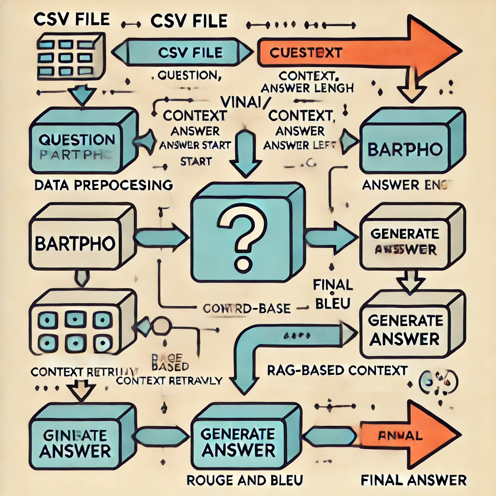

<div style="wight: 100%; height: 100%;">
    
</div>

## BARTpho QA Model with Vietnamese Medical Dataset

This repository implements a Question Answering (QA) model utilizing the BARTpho architecture, fine-tuned on a Vietnamese medical dataset. The model is designed to predict the answer span from a given passage based on the associated question.

### Project Overview
- **Model**: BARTpho (Word version) [`vinai/bartpho-word-base`](https://huggingface.co/vinai/bartpho-word-base) specifically fine-tuned for QA tasks in Vietnamese.
- **Dataset**: A collection of Vietnamese medical texts.
- **Objective**: To extract accurate answers from complex medical texts in response to user queries.

### Pre-trained models

Model | #params | Arch. | Max length | Input text
---|---|---|---|---
[`vinai/bartpho-syllable-base`](https://huggingface.co/vinai/bartpho-syllable-base) | 132M | base | 1024 | Syllable level
[`vinai/bartpho-syllable`](https://huggingface.co/vinai/bartpho-syllable) | 396M | large | 1024 | Syllable level
[`vinai/bartpho-word-base`](https://huggingface.co/vinai/bartpho-word-base) | 150M | base | 1024 | Word level
[`vinai/bartpho-word`](https://huggingface.co/vinai/bartpho-word) | 420M | large | 1024 | Word level

### Theoretical Background on QA in BARTpho
Question Answering (QA) is a crucial application of Natural Language Processing (NLP) that allows users to obtain specific answers to their queries from textual data. In the context of the BARTpho model, QA involves the following steps:

1. **Understanding Context**: The model leverages its transformer architecture to comprehend the context of both the question and the relevant passage. This is achieved through attention mechanisms that enable the model to focus on pertinent information while disregarding irrelevant details.

2. **Answer Extraction**: After parsing the input, the model identifies potential answer spans within the text. This involves locating the start and end positions of the answer based on the semantic relationships between the question and the passage.

3. **Fine-tuning for Domain-Specific Language**: The BARTpho model is fine-tuned on a specialized dataset consisting of medical texts. This process enhances its ability to handle domain-specific terminology and complex sentence structures common in medical literature, ultimately improving the accuracy of its responses.

4. **Evaluation Metrics**: To assess the effectiveness of the QA system, we utilize metrics such as ROUGE and BLEU. These metrics help quantify the model’s performance in terms of accuracy, fluency, and relevance of the generated answers.

### Dataset Description
The dataset consists of the following columns:

| Column          | Description                                             |
|------------------|---------------------------------------------------------|
| Title            | The title of the article.                              |
| Detailed Content | The passage of text from which answers are extracted.  |
| Answer           | The actual answer contained within the text.           |
| Keywords         | Relevant keywords associated with the content.         |
| Question         | The question pertaining to the content.                |
| Answer_Start     | The starting index of the answer in the passage.       |
| Answer_End       | The ending index of the answer in the passage.         |
| Reference Link   | A link to the original source of the content.          |

### Sample Data Structure
| Title | Detailed Content | Answer | Keywords | Question | Answer_Start | Answer_End | Reference Link |

### Setup

#### Prerequisites
To set up the environment, ensure you have the following:
- Python >= 3.7
- PyTorch >= 1.9
- Hugging Face transformers and datasets
- Additional libraries: tqdm, rouge-score, nltk

#### Installation Instructions
Clone the repository using the following commands:

```bash
git clone https://github.com/TRAN-VAN-LUAN/ChatBox_Transformer.git
cd CHATBOX
pip install -r requirements.txt
